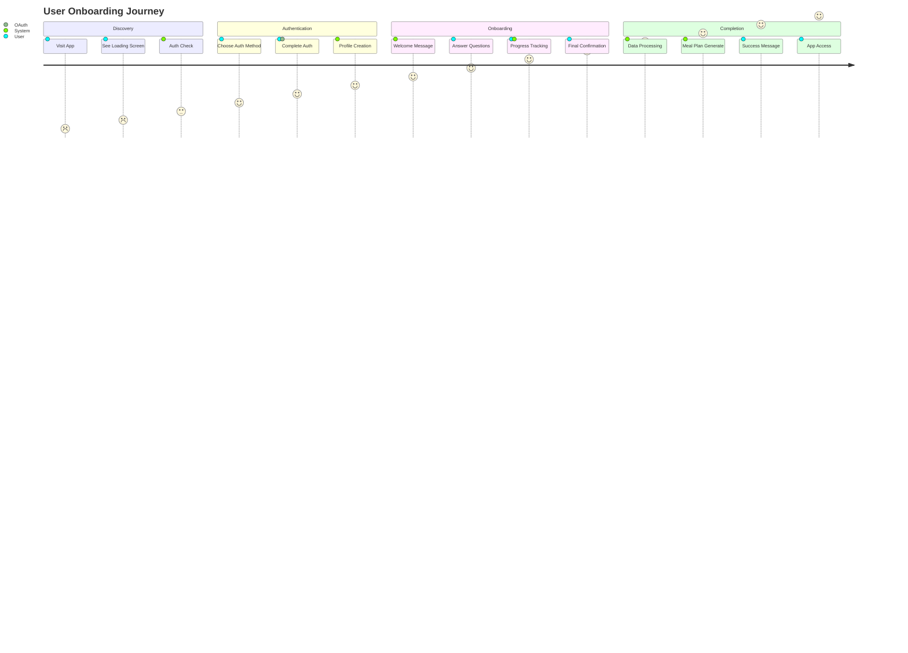

# Meal Planner Onboarding System - Master Planning Document

## Document Overview

This document serves as the **definitive reference** for the meal planner onboarding system. It consolidates comprehensive research, analysis, and planning to govern all future development work related to user onboarding.

**Document Status**: Master Reference Document  
**Version**: 1.0  
**Last Updated**: 2025-01-15  
**Scope**: Complete onboarding system architecture and implementation  

---

## Executive Summary

The meal planner onboarding system is a sophisticated, multi-layered user experience that transforms anonymous visitors into fully onboarded users with personalized meal planning capabilities. The system supports multiple authentication methods, implements a 12-step conversational questionnaire, and includes comprehensive error handling and recovery mechanisms.

### Key System Characteristics
- **Multi-modal authentication** (Email, Google OAuth, GitHub OAuth)
- **Conversational UX** with AI-like interaction patterns
- **Transactional completion** with retry logic and verification
- **Graceful degradation** with localStorage fallback
- **Comprehensive error recovery** with database-level healing functions

### Current System Status
- **Functional but fragile** - Working in happy path scenarios
- **Race condition vulnerabilities** - Session flags set before completion
- **Data consistency issues** - Potential database state corruption
- **Limited error visibility** - Insufficient debugging capabilities

---

## System Architecture Overview

### 1. Core Components

```
┌─────────────────────────────────────────────────────────────┐
│                    ONBOARDING SYSTEM                         │
├─────────────────────────────────────────────────────────────┤
│                                                             │
│  ┌─────────────────┐  ┌─────────────────┐  ┌─────────────────┐ │
│  │  AUTHENTICATION │  │  CONVERSATION   │  │   COMPLETION    │ │
│  │     LAYER       │  │     ENGINE      │  │   PROCESSOR     │ │
│  │                 │  │                 │  │                 │ │
│  │ • OAuth         │  │ • 12-step flow  │  │ • Transactional │ │
│  │ • Email/Pass    │  │ • Data collect  │  │ • Verification  │ │
│  │ • Session mgmt  │  │ • Progress track│  │ • Recovery      │ │
│  └─────────────────┘  └─────────────────┘  └─────────────────┘ │
│                                                             │
├─────────────────────────────────────────────────────────────┤
│                                                             │
│  ┌─────────────────┐  ┌─────────────────┐  ┌─────────────────┐ │
│  │    DATABASE     │  │   ERROR HANDLING│  │     UI/UX       │ │
│  │     LAYER       │  │   & RECOVERY    │  │   COMPONENTS    │ │
│  │                 │  │                 │  │                 │ │
│  │ • Profile mgmt  │  │ • Retry logic   │  │ • Modal system  │ │
│  │ • Constraints   │  │ • State healing │  │ • Progress UI   │ │
│  │ • Transactions  │  │ • Debugging     │  │ • Input forms   │ │
│  └─────────────────┘  └─────────────────┘  └─────────────────┘ │
│                                                             │
└─────────────────────────────────────────────────────────────┘
```

### 2. Technology Stack

**Frontend**:
- **HTML5** with custom CSS and JavaScript
- **Tailwind CSS** for styling
- **Modal-based UI** with progressive disclosure
- **Local/Session Storage** for fallback scenarios

**Backend**:
- **Supabase** as primary backend service
- **PostgreSQL** database with JSONB support
- **Row Level Security (RLS)** for data protection
- **Supabase Auth** for authentication management

**Integration**:
- **OAuth Providers** (Google, GitHub)
- **Email/Password** authentication
- **Real-time** state synchronization
- **Progressive Web App** capabilities

---

## User Journey & Experience Design

### 1. Complete User Flow



### 2. Conversation Design

**Conversation Philosophy**:
- **Human-like interaction** with AI assistant persona
- **Progressive disclosure** of questions
- **Flexible response formats** (quick-select + free text)
- **Contextual validation** and encouragement

**Sample Conversation Flow**:
```
System: "Hi! I'm excited to help you create a meal planning system that actually works for your life. Let's start with the basics - tell me a bit about your age and living situation?"

User: "I'm 28 and live in a shared flat with flatmates"

System: "Got it! Living with flatmates can definitely impact how you cook and plan meals. Now, I want to make sure this system works for everyone. Do any of these situations apply to you?"
[Quick-select options: ADHD, Depression, Chronic fatigue, etc.]

User: Selects "ADHD" + adds "Some days are just harder"

System: "Thank you for sharing that - it's really helpful to know. I'll make sure to suggest strategies that work well for ADHD brains. Now, tell me about your relationship with cooking..."
```

### 3. Data Collection Strategy

**Information Architecture**:
- **Personal Context**: Age, living situation, accessibility needs
- **Cooking Foundation**: Background, experience, comfort level
- **Practical Constraints**: Equipment, dietary needs, schedule
- **Preferences**: Cuisines, flavors, planning style
- **Goals**: Challenges to address, outcomes desired

**Response Processing**:
- **Quick-select options** → Structured categorical data
- **Free text responses** → Natural language processing
- **Combined responses** → Rich contextual understanding
- **Conversation history** → Complete audit trail

---

## Technical Architecture

### 1. Database Schema Design

**Core Tables**:
```sql
-- Primary user profiles table
CREATE TABLE user_profiles (
    id UUID PRIMARY KEY REFERENCES auth.users(id),
    email TEXT NOT NULL,
    display_name TEXT,
    avatar_url TEXT,
    
    -- Onboarding completion tracking
    onboarding_completed BOOLEAN DEFAULT FALSE,
    onboarding_date TIMESTAMPTZ,
    onboarding_type TEXT DEFAULT 'conversational',
    
    -- Structured onboarding data
    age_range TEXT,
    living_situation TEXT,
    accessibility_needs TEXT,
    cooking_background TEXT,
    dietary_needs TEXT,
    kitchen_equipment TEXT,
    schedule_energy TEXT,
    goals_challenges TEXT,
    skills_comfort TEXT,
    flavor_preferences TEXT,
    planning_style TEXT,
    breakfast_preferences TEXT,
    
    -- Complete conversation history
    full_conversation JSONB DEFAULT '{}',
    
    -- Metadata
    profile_version TEXT DEFAULT '5.0',
    created_at TIMESTAMPTZ DEFAULT NOW(),
    updated_at TIMESTAMPTZ DEFAULT NOW()
);

-- Related tables
CREATE TABLE recipes (
    id UUID PRIMARY KEY DEFAULT gen_random_uuid(),
    user_id UUID REFERENCES auth.users(id),
    title TEXT NOT NULL,
    ingredients TEXT[],
    instructions TEXT[],
    energy_level TEXT CHECK (energy_level IN ('high', 'medium', 'low')),
    prep_time INTEGER,
    cook_time INTEGER,
    servings INTEGER,
    tags TEXT[],
    is_public BOOLEAN DEFAULT false,
    created_at TIMESTAMPTZ DEFAULT NOW(),
    updated_at TIMESTAMPTZ DEFAULT NOW()
);

CREATE TABLE meal_plans (
    id UUID PRIMARY KEY DEFAULT gen_random_uuid(),
    user_id UUID REFERENCES auth.users(id),
    week_start DATE NOT NULL,
    meals JSONB NOT NULL DEFAULT '{}',
    is_template BOOLEAN DEFAULT false,
    template_name TEXT,
    shared_with UUID[],
    created_at TIMESTAMPTZ DEFAULT NOW(),
    updated_at TIMESTAMPTZ DEFAULT NOW(),
    
    UNIQUE(user_id, week_start, is_template)
);
```

**Data Integrity Constraints**:
```sql
-- Ensure onboarding completion consistency
ALTER TABLE user_profiles ADD CONSTRAINT onboarding_date_consistency 
CHECK (
    (onboarding_completed = false AND onboarding_date IS NULL) OR
    (onboarding_completed = true AND onboarding_date IS NOT NULL)
);

-- Validate conversation completeness
ALTER TABLE user_profiles ADD CONSTRAINT conversation_completeness
CHECK (
    (onboarding_completed = false) OR 
    (onboarding_completed = true AND full_conversation IS NOT NULL)
);
```

### 2. Application Layer Architecture

**JavaScript Module Structure**:
```javascript
// Core API abstraction
class MealPlannerAPI {
    // Authentication management
    async signUp(email, password, userData)
    async signIn(email, password)
    async signInWithProvider(provider)
    
    // Profile management
    async getUserProfile()
    async updateUserProfile(profileData)
    
    // Transactional onboarding
    async completeOnboardingTransaction(onboardingData)
    async retryOnboardingCompletion(onboardingData, maxRetries)
    async verifyOnboardingComplete()
    async recoverIncompleteOnboarding()
}

// Onboarding conversation engine
class OnboardingEngine {
    startConversation()
    processResponse(response)
    advanceToNextStep()
    completeOnboarding()
}

// Debug and monitoring
class OnboardingDebugger {
    log(level, message, data)
    trackStateChange(from, to, metadata)
    trackApiCall(method, endpoint, data, result, error)
    exportLogs()
}
```

**State Management**:
```javascript
// Global state hierarchy
const appState = {
    // Authentication state
    user: null,
    session: null,
    isAuthenticated: false,
    
    // Onboarding state
    onboardingStep: 0,
    onboardingCompleted: false,
    userOnboardingData: {
        name: '',
        responses: []
    },
    
    // UI state
    showAuthGate: true,
    showOnboardingModal: false,
    currentTab: 'auth'
};
```

### 3. Error Handling & Recovery

**Multi-Layer Error Strategy**:
```javascript
// Retry logic with exponential backoff
async function retryOnboardingCompletion(onboardingData, maxRetries = 3) {
    let lastError;
    
    for (let attempt = 1; attempt <= maxRetries; attempt++) {
        try {
            // Attempt transactional completion
            const result = await this.completeOnboardingTransaction(onboardingData);
            
            // Verify completion
            const verification = await this.verifyOnboardingComplete();
            if (!verification.success) {
                throw new Error('Verification failed');
            }
            
            return result;
            
        } catch (error) {
            lastError = error;
            
            if (attempt < maxRetries) {
                const delay = Math.pow(2, attempt) * 1000;
                await new Promise(resolve => setTimeout(resolve, delay));
            }
        }
    }
    
    throw new Error(`Failed after ${maxRetries} attempts: ${lastError.message}`);
}

// Database-level recovery
CREATE OR REPLACE FUNCTION recover_incomplete_onboarding()
RETURNS TABLE(user_id UUID, email TEXT, issue_type TEXT, action_taken TEXT) AS $$
BEGIN
    -- Identify and fix inconsistent states
    UPDATE user_profiles 
    SET 
        onboarding_completed = CASE 
            WHEN has_complete_conversation(full_conversation) THEN true 
            ELSE false 
        END,
        onboarding_date = CASE 
            WHEN onboarding_completed = true AND onboarding_date IS NULL
            THEN COALESCE(updated_at, created_at)
            ELSE onboarding_date
        END
    WHERE has_inconsistent_state();
    
    RETURN QUERY SELECT * FROM fixed_users;
END;
$$ LANGUAGE plpgsql;
```

---

## Implementation Roadmap

### Phase 1: Foundation Stabilization (Weeks 1-2)
**Goal**: Fix critical issues and establish stable foundation

**Tasks**:
1. **Database Schema Fixes**
   - Fix duplicate column issues
   - Add proper constraints
   - Implement recovery functions

2. **Race Condition Resolution**
   - Move completion flag setting to end of process
   - Implement proper verification
   - Add transactional completion

3. **Error Handling Enhancement**
   - Add comprehensive logging
   - Implement retry mechanisms
   - Create debug tools

**Deliverables**:
- Fixed database schema
- Transactional completion system
- Debug monitoring tools
- Comprehensive error handling

### Phase 2: User Experience Enhancement (Weeks 3-4)
**Goal**: Improve user experience and reduce friction

**Tasks**:
1. **Conversation Flow Optimization**
   - Improve question progression
   - Add better validation
   - Enhance response processing

2. **UI/UX Improvements**
   - Better progress indicators
   - Improved error messages
   - Enhanced mobile experience

3. **Performance Optimization**
   - Optimize database queries
   - Implement caching
   - Reduce load times

**Deliverables**:
- Optimized conversation flow
- Enhanced user interface
- Performance improvements
- Mobile optimization

### Phase 3: Advanced Features (Weeks 5-6)
**Goal**: Add advanced functionality and monitoring

**Tasks**:
1. **Advanced Recovery**
   - Automatic state healing
   - Background data migration
   - User notification system

2. **Analytics & Monitoring**
   - Completion rate tracking
   - Error pattern analysis
   - Performance monitoring

3. **A/B Testing Framework**
   - Question variation testing
   - UX optimization testing
   - Conversion rate optimization

**Deliverables**:
- Advanced recovery system
- Comprehensive analytics
- A/B testing framework
- Performance monitoring

### Phase 4: Scale & Optimization (Weeks 7-8)
**Goal**: Prepare for scale and long-term maintenance

**Tasks**:
1. **Scalability Improvements**
   - Database optimization
   - Connection pooling
   - Caching strategy

2. **Maintainability**
   - Code documentation
   - Testing framework
   - Deployment automation

3. **Security Hardening**
   - Security audit
   - Performance optimization
   - Compliance review

**Deliverables**:
- Scalable architecture
- Comprehensive documentation
- Security hardening
- Production readiness

---

## Risk Assessment & Mitigation

### High Risk Items

**1. Database Corruption**
- **Risk**: Inconsistent onboarding states causing user lockout
- **Impact**: High - Users cannot complete onboarding
- **Mitigation**: Recovery functions, monitoring, automated healing

**2. Authentication Failures**
- **Risk**: OAuth provider issues or auth token expiration
- **Impact**: Medium - Users cannot authenticate
- **Mitigation**: Multiple auth methods, error handling, fallback flows

**3. Data Loss**
- **Risk**: Onboarding responses lost due to session issues
- **Impact**: Medium - Users must restart onboarding
- **Mitigation**: Progressive saving, session recovery, localStorage backup

### Medium Risk Items

**4. Performance Degradation**
- **Risk**: Database queries slow down with user growth
- **Impact**: Medium - Poor user experience
- **Mitigation**: Query optimization, indexing, caching

**5. UI/UX Issues**
- **Risk**: Confusing interface or poor mobile experience
- **Impact**: Medium - Lower completion rates
- **Mitigation**: User testing, responsive design, progressive enhancement

### Low Risk Items

**6. Third-party Dependencies**
- **Risk**: Supabase service disruption
- **Impact**: Low - Temporary service unavailability
- **Mitigation**: Status monitoring, fallback mechanisms, user communication

---

## Success Metrics & KPIs

### Primary Metrics

**1. Onboarding Completion Rate**
- **Target**: >85% of authenticated users complete onboarding
- **Current**: Unknown (needs measurement)
- **Measurement**: Database query of completion states

**2. Time to Complete**
- **Target**: <10 minutes average completion time
- **Current**: Unknown (needs measurement)
- **Measurement**: Track time from start to completion

**3. Error Rate**
- **Target**: <5% of onboarding attempts result in errors
- **Current**: Unknown (needs measurement)
- **Measurement**: Monitor error logs and recovery attempts

### Secondary Metrics

**4. User Satisfaction**
- **Target**: >4.0/5.0 satisfaction rating
- **Measurement**: Post-onboarding survey

**5. Data Quality**
- **Target**: >90% of responses contain meaningful data
- **Measurement**: Analysis of response content

**6. Recovery Success Rate**
- **Target**: >95% of errors automatically recovered
- **Measurement**: Monitor recovery function success

---

## Monitoring & Maintenance

### Monitoring Strategy

**1. Health Checks**
```sql
-- Weekly health check query
SELECT onboarding_health_check();

-- Real-time monitoring
SELECT COUNT(*) as incomplete_users
FROM user_profiles 
WHERE onboarding_completed = false 
AND created_at < NOW() - INTERVAL '24 hours';
```

**2. Performance Monitoring**
- Database query performance
- API response times
- User interaction metrics
- Error occurrence patterns

**3. User Experience Monitoring**
- Conversion funnel analysis
- Drop-off point identification
- User feedback collection
- A/B test results

### Maintenance Tasks

**Daily**:
- Monitor error logs
- Check completion rates
- Review user feedback

**Weekly**:
- Run health check functions
- Analyze performance metrics
- Update documentation

**Monthly**:
- Database maintenance
- Security audit
- Performance optimization
- User experience review

---

## Future Enhancements

### Short-term (3-6 months)

**1. AI-Powered Personalization**
- Machine learning for meal recommendations
- Adaptive questioning based on responses
- Personalized onboarding paths

**2. Social Features**
- Share meal plans with family/friends
- Community recipe sharing
- Collaborative meal planning

**3. Advanced Analytics**
- Predictive modeling for completion
- User behavior analysis
- Optimization recommendations

### Medium-term (6-12 months)

**4. Mobile Application**
- Native mobile app
- Offline functionality
- Push notifications

**5. Integration Ecosystem**
- Grocery delivery integration
- Recipe import from external sources
- Calendar integration

**6. Advanced Meal Planning**
- Seasonal meal suggestions
- Budget-conscious planning
- Health goal integration

### Long-term (12+ months)

**7. AI Assistant**
- Natural language meal planning
- Voice interface support
- Proactive suggestions

**8. Advanced Personalization**
- Learning from user behavior
- Continuous profile refinement
- Predictive meal planning

**9. Ecosystem Expansion**
- Nutrition tracking integration
- Fitness app connections
- Health provider partnerships

---

## Conclusion

This master planning document provides a comprehensive foundation for the meal planner onboarding system. It combines detailed technical analysis with strategic planning to create a roadmap for building a robust, scalable, and user-friendly onboarding experience.

The current system has strong foundations but requires stabilization and enhancement to meet production standards. The phased implementation approach allows for systematic improvement while maintaining system stability.

Key success factors:
- **Data integrity** through proper database design and constraints
- **User experience** through thoughtful conversation design and error handling
- **System reliability** through comprehensive testing and monitoring
- **Scalable architecture** through proper technical design and optimization

This document should be treated as a living document, updated regularly as the system evolves and new requirements emerge. All future onboarding work should reference this document to ensure consistency and alignment with the overall system architecture.

---

**Document Maintenance**:
- Review quarterly for accuracy and relevance
- Update after major system changes
- Incorporate lessons learned from implementation
- Align with broader product roadmap changes

**Related Documents**:
- `ONBOARDING-WORKFLOW-DIAGRAM.md` - Visual workflow reference
- `debug-onboarding.sql` - Database diagnostic queries
- `fix-schema-issues.sql` - Database schema fixes
- `create-onboarding-functions.sql` - Database recovery functions
- `js/onboarding-debug.js` - Debug tools implementation