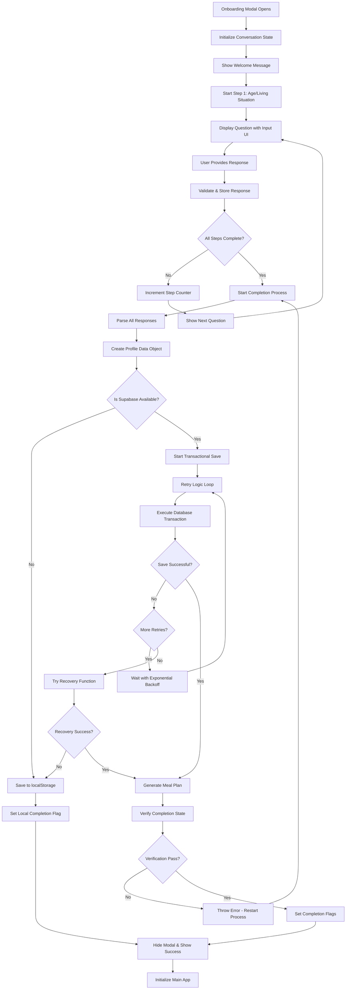
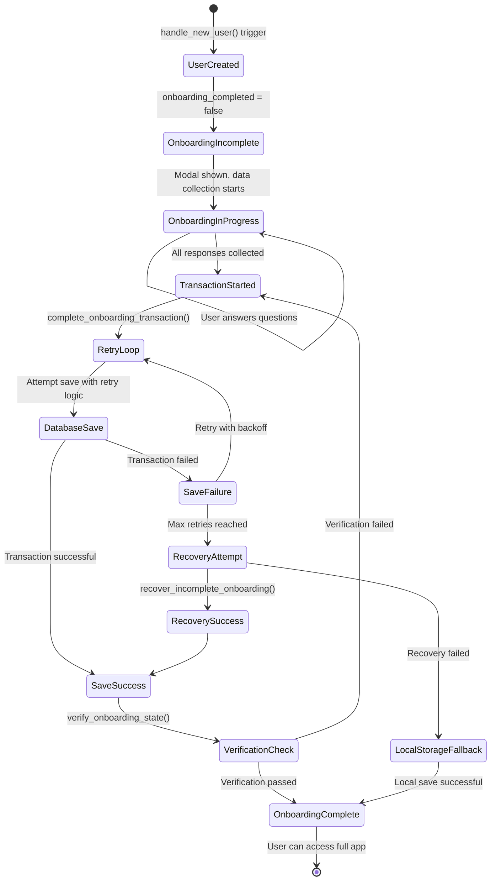
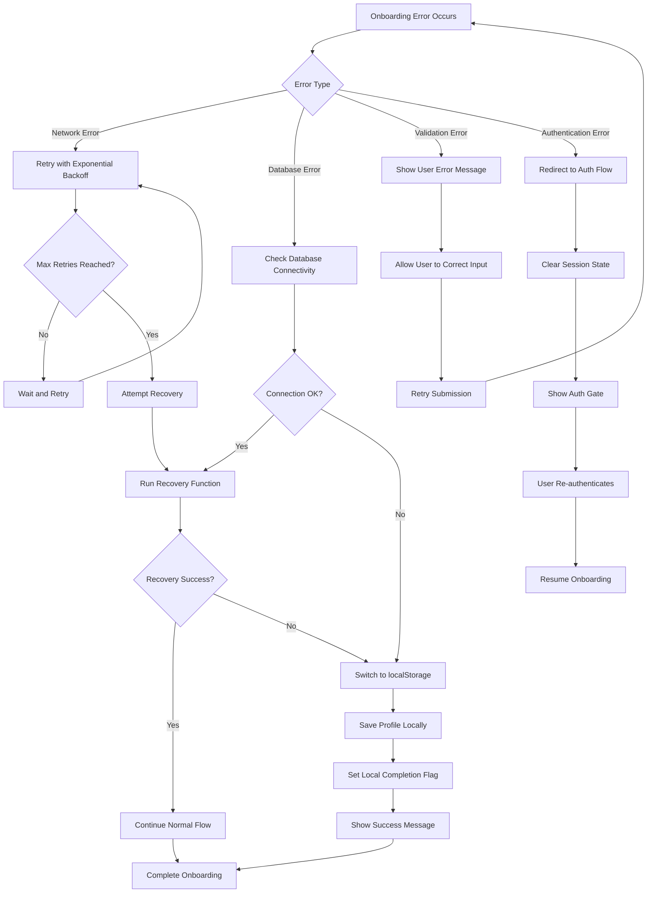

# Meal Planner Onboarding Workflow Diagram

## High-Level System Overview

```
┌─────────────────────────────────────────────────────────────────────────────────────────┐
│                                MEAL PLANNER ONBOARDING SYSTEM                             │
├─────────────────────────────────────────────────────────────────────────────────────────┤
│                                                                                           │
│  ┌─────────────────┐    ┌─────────────────┐    ┌─────────────────┐    ┌─────────────────┐ │
│  │   ANONYMOUS     │    │  AUTHENTICATED  │    │   ONBOARDING    │    │    ONBOARDED   │ │
│  │     USER        │───▶│      USER       │───▶│     IN PROGRESS │───▶│      USER       │ │
│  │                 │    │                 │    │                 │    │                 │ │
│  └─────────────────┘    └─────────────────┘    └─────────────────┘    └─────────────────┘ │
│                                                                                           │
└─────────────────────────────────────────────────────────────────────────────────────────┘
```

## Detailed Authentication Flow

```mermaid
graph TD
    A[User Visits App] --> B{Is User Authenticated?}
    B -->|No| C[Show Auth Gate]
    B -->|Yes| D{Has Complete Profile?}
    
    C --> E[User Selects Auth Method]
    E --> F{Auth Method}
    F -->|Email/Password| G[Email Auth Flow]
    F -->|Google OAuth| H[Google OAuth Flow]
    F -->|GitHub OAuth| I[GitHub OAuth Flow]
    
    G --> J[Supabase Auth]
    H --> J
    I --> J
    
    J --> K{Auth Success?}
    K -->|No| L[Show Error Message]
    K -->|Yes| M[Create/Update User Profile]
    
    L --> C
    M --> N[Trigger handle_new_user()]
    N --> D
    
    D -->|No| O[Show Onboarding Modal]
    D -->|Yes| P[Show Main App]
    
    O --> Q[Start Conversational Onboarding]
    Q --> R[Complete Onboarding Process]
    R --> S[Verify Completion]
    S --> P
```

## Complete Onboarding Process Flow



## Database State Management



## Data Collection Structure

```
Onboarding Data Collection Flow:
├── Step 1: Age/Living Situation
│   ├── Input Type: Free text
│   ├── Storage: age_range, living_situation
│   └── Example: "I'm 28 and live in a shared flat with flatmates"
│
├── Step 2: Accessibility Needs
│   ├── Input Type: Quick-select + Additional text
│   ├── Options: ADHD, Depression, Chronic fatigue, etc.
│   ├── Storage: accessibility_needs
│   └── Example: "ADHD | Depression | Some days are just harder"
│
├── Step 3: Cooking Background
│   ├── Input Type: Free text
│   ├── Storage: cooking_background
│   └── Example: "I'm a confident cook but struggle with meal planning"
│
├── Step 4: Dietary Needs
│   ├── Input Type: Quick-select + Additional text
│   ├── Options: Vegetarian, Vegan, Gluten-free, etc.
│   ├── Storage: dietary_needs
│   └── Example: "Vegetarian | Trying to reduce dairy"
│
├── Step 5: Kitchen Equipment
│   ├── Input Type: Quick-select + Additional text
│   ├── Options: Basic tools, Stand mixer, Food processor, etc.
│   ├── Storage: kitchen_equipment
│   └── Example: "Good knives | Stand mixer | I love my cast iron"
│
├── Step 6: Schedule/Energy
│   ├── Input Type: Quick-select + Additional text
│   ├── Options: High energy mornings, Tired after work, etc.
│   ├── Storage: schedule_energy
│   └── Example: "High energy mornings | Dead tired after work"
│
├── Step 7: Goals/Challenges
│   ├── Input Type: Quick-select + Additional text
│   ├── Options: Save money, Eat healthier, Reduce food waste, etc.
│   ├── Storage: goals_challenges
│   └── Example: "Save money | Eat healthier | Stop ordering takeout"
│
├── Step 8: Skills/Comfort
│   ├── Input Type: Quick-select + Additional text
│   ├── Options: Knife skills, Seasoning, Timing, etc.
│   ├── Storage: skills_comfort
│   └── Example: "Good at knife skills | Struggle with timing"
│
├── Step 9: Cuisine Preferences
│   ├── Input Type: Quick-select + Additional text
│   ├── Options: Italian, Asian, Mexican, etc.
│   ├── Storage: flavor_preferences
│   └── Example: "Italian | Asian | Love spicy food"
│
├── Step 10: Planning Style
│   ├── Input Type: Quick-select + Additional text
│   ├── Options: Detailed plans, Flexible, Spontaneous, etc.
│   ├── Storage: planning_style
│   └── Example: "Flexible approach | Some structure helps"
│
├── Step 11: Breakfast Preferences
│   ├── Input Type: Quick-select + Additional text
│   ├── Options: Quick breakfast, Hearty breakfast, Skip breakfast, etc.
│   ├── Storage: breakfast_preferences
│   └── Example: "Quick breakfast | Usually just coffee"
│
└── Step 12: Final Confirmation
    ├── Input Type: Confirmation button
    ├── Action: Triggers completion process
    └── Result: Profile saved, meal plan generated, onboarding complete
```

## Error Handling & Recovery Workflow



## Session & State Management

```
Session State Hierarchy:
├── Browser Session Storage
│   ├── onboardingCompleted: 'true'/'false'
│   ├── Used for: Preventing restart loops
│   └── Cleared on: Browser close
│
├── Database State (Primary)
│   ├── onboarding_completed: BOOLEAN
│   ├── onboarding_date: TIMESTAMPTZ
│   ├── Used for: Persistent state across sessions
│   └── Cleared on: Manual admin action
│
├── Local Storage (Fallback)
│   ├── userProfile: JSON object
│   ├── Used for: Offline or database failure scenarios
│   └── Cleared on: Manual clearing or successful migration
│
└── Memory State (Runtime)
    ├── userOnboardingData: Object
    ├── onboardingStep: Integer
    ├── Used for: Current session workflow
    └── Cleared on: Page refresh or completion
```

## Performance Optimization Points

```
Critical Performance Checkpoints:
├── Initial Load
│   ├── Supabase client initialization
│   ├── Authentication state check
│   └── Profile completion check
│
├── Onboarding Modal
│   ├── Conversation state initialization
│   ├── Progressive question rendering
│   └── Response validation and storage
│
├── Completion Transaction
│   ├── Database transaction with retry logic
│   ├── Meal plan generation
│   └── Verification checks
│
└── App Initialization
    ├── Profile data loading
    ├── Meal plan data loading
    └── UI state restoration
```

## Integration Points

```
External System Integration:
├── Supabase Authentication
│   ├── OAuth providers (Google, GitHub)
│   ├── Email/password authentication
│   └── Session management
│
├── Database Operations
│   ├── Profile CRUD operations
│   ├── Meal plan storage
│   └── Recipe management
│
├── Frontend Components
│   ├── React-like component updates
│   ├── Modal management
│   └── State synchronization
│
└── Third-party Services
    ├── Email service integration
    ├── Analytics tracking
    └── Error reporting
```

This comprehensive workflow diagram provides a complete visual representation of the onboarding system, showing all decision points, data flows, error handling, and integration points. It serves as a technical reference for understanding the entire system architecture and can guide future development and troubleshooting efforts.